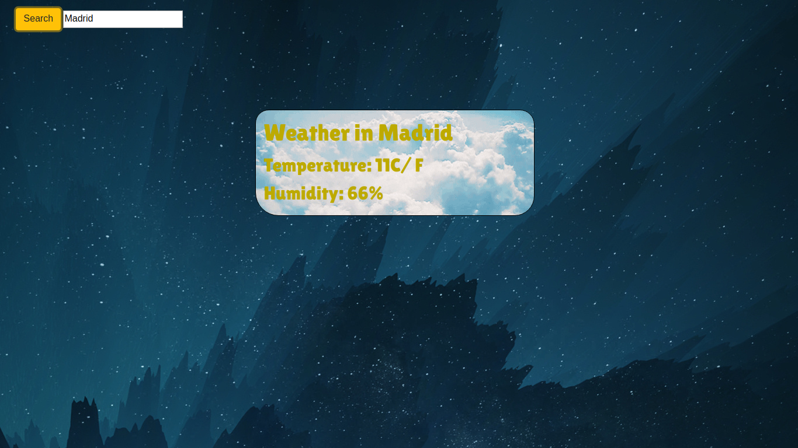

  <h3 align="center">Weather Application</h3>

  

    JavaScript Project
     
     
    <a href="#">View Demo</a>
    ·
    <a href="https://github.com/samgaco/todolist/issues">Report Bug</a>
    ·
    <a href="https://github.com/samgaco/todolist/issues">Request Feature</a>
  

<!-- TABLE OF CONTENTS -->
## Table of Contents

* [About the Project](#about-the-project)
  * [Built With](#built-with)
* [Contact](#Contact)

<!-- ABOUT THE PROJECT -->
## About The Project

  

Based on the [Weather Application](https://www.theodinproject.com/courses/javascript/lessons/weather-app) in the odin project as a part of the Microverse curriculum

The purpose is to get a good understanding how to use API services and make use of JavaScript promises.

The application gets a city as an input and returns some weather information.

### Built With
* [JavaScript](https://www.javascript.com/)
* [webpack](https://webpack.js.org/)

### Contact

* [Samuel García Companys](https://github.com/samgaco) - samuelgarciacompanys@gmail.com - [Linkedin](https://www.linkedin.com/in/samuel-garc%C3%ADa-companys-0a848284/)
